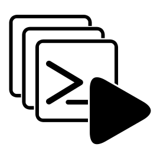

# Workspace Terminals

**Workspace Terminals** is a Visual Studio Code extension that automatically opens customizable integrated terminals based on workspace-specific configurations. It enhances your development workflow by predefining terminal setups for each project.

## Features

* Automatic Terminal Launch on workspace open.
* Customizable terminal name, icon, color, working directory, shell path, and arguments.
* Manual trigger via Command Palette or UI buttons.
* Optional Activity Bar button to launch terminals.
* Optional Terminal Tab Pane button for quick access.
* Multi-root Workspace Support.
* Non-intrusive; reads configurations without modifying files.

## Installation from Source

1. Ensure you have [Visual Studio Code](https://code.visualstudio.com/) installed.
2. Clone or download this repository.
3. Run `npm install` to install dependencies.
4. Run `npm run compile` to compile the extension.
5. Run `npm run package` to package the extension.
6. Install the generated `.vsix` file in VS Code:

   * Open Command Palette (`Ctrl+Shift+P` / `Cmd+Shift+P`)
   * Select `Extensions: Install from VSIX...`
   * Choose the generated `.vsix` file.

## Usage

1. Open your workspace in VS Code.
2. Add the following configuration to your `.code-workspace` file:

```json
{
  "settings": {
    "workspaceTerminals.terminals": [
      {
        "name": "Server",
        "icon": "rocket",
        "color": "terminal.ansiGreen",
        "workingDir": "server",
        "shellPath": "npm",
        "shellArgs": ["run", "start"]
      },
      {
        "name": "Client",
        "icon": "terminal",
        "color": "terminal.ansiBlue",
        "workingDir": "client",
        "shellPath": "npm",
        "shellArgs": ["run", "dev"]
      }
    ],
    "workspaceTerminals.activityBarButton": true,
    "workspaceTerminals.activityBarButtonPosition": "right",
    "workspaceTerminals.terminalTabPaneButton": true
  }
}
```

3. Terminals open automatically when opening the workspace.
4. You can manually launch terminals by:

   * Running `Workspace Terminals: Launch Terminals` from Command Palette.
   * Clicking the Activity Bar or Terminal Tab Pane button (if enabled).

## Configuration

### Terminal Configuration

* `workspaceTerminals.terminals` (array)

  * `name` (string, required): Display name.
  * `icon` (string, optional): Codicon icon name.
  * `color` (string, optional): Theme color ID.
  * `workingDir` (string, required): Relative (based on the `folder` config. If you set `name`, use the `name` instead of folder `path`) or absolute working directory.
  * `shellPath` (string, required): Shell executable path or command.
  * `shellArgs` (array, optional): Arguments for the shell.

### UI Configuration

* `workspaceTerminals.activityBarButton` (boolean, default `false`)
* `workspaceTerminals.activityBarButtonPosition` (string, `left` or `right`, default `right`)
* `workspaceTerminals.terminalTabPaneButton` (boolean, default `true`)

## Commands

* `workspaceTerminals.launchTerminals`: Launch configured terminals.

## Development

1. Clone the repository.
2. Run `npm install`.
3. Run `npm run watch`.
4. Open in VS Code and press `F5` to start Extension Development Host.

## License

GNU GPLv3

## Author

**[WolfCoder161](https://github.com/WolfCoder161)**


